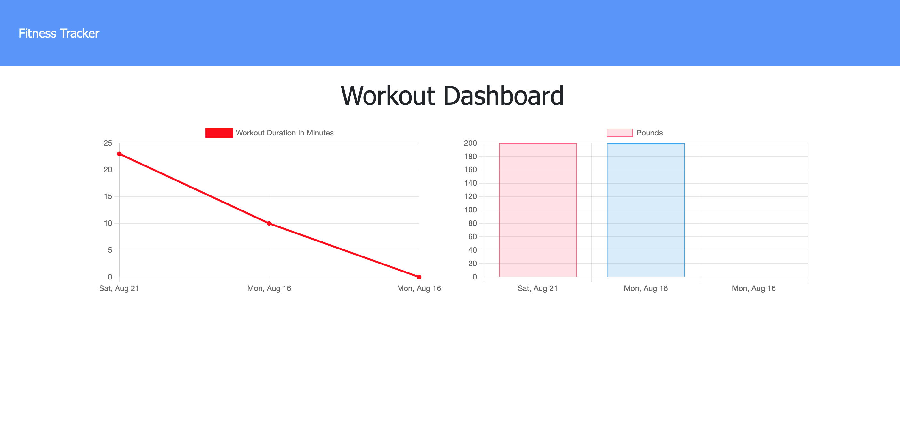
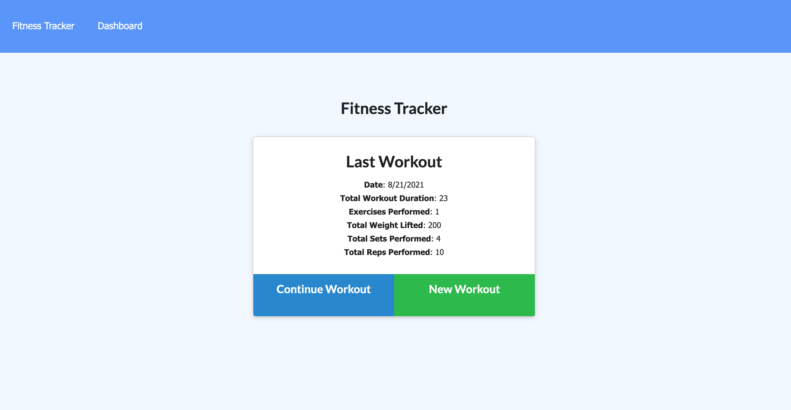

# Fitness Tracker

# Description
This is an application to help the user track their workouts using MongoDb.

User can add the workouts they have completed by day and include a variety of classificaitons like the type of exercise (aerobic or resistance), duraiton, reps, weigth, and more. Exercises can also be deleted updated or modified.

The stats of these workouts will be displayed in an two easy to comprehend graphs so user can easily track thier progress.

   
    

# Links

  * Heroku link: https://pacific-dusk-45260.herokuapp.com/
  * GitHub link: https://github.com/aydanegash/fitness-tracker

# License 

  MIT License 
